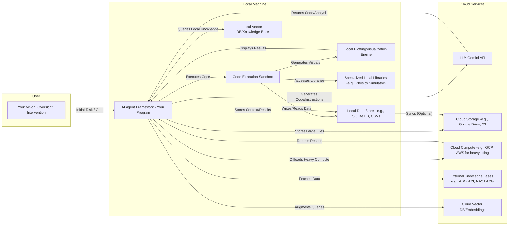

```mermaid

graph LR
    subgraph User
        A[You: Vision, Oversight, Intervention]
    end

    subgraph Local Machine 
        B[AI Agent Framework - Your Program]
        C[Code Execution Sandbox]
        D[Local Data Store - e.g., SQLite DB, CSVs]
        E[Local Vector DB/Knowledge Base]
        F[Local Plotting/Visualization Engine]
        G[Specialized Local Libraries -e.g., Physics Simulators]
    end

    subgraph Cloud Services
        H[LLM Gemini API]
        I[Cloud Storage -e.g., Google Drive, S3]
        J[Cloud Compute -e.g., GCP, AWS for heavy lifting]
        K[External Knowledge Bases e.g., ArXiv API, NASA APIs]
        L[Cloud Vector DB/Embeddings]
    end

    A -- "Initial Task / Goal" --> B
    B -- "Generates Code/Instructions" --> H
    H -- "Returns Code/Analysis" --> B
    B -- "Executes Code" --> C
    C -- "Writes/Reads Data" --> D
    C -- "Accesses Libraries" --> G
    C -- "Generates Visuals" --> F
    F -- "Displays Results" --> B
    B -- "Stores Context/Results" --> D
    B -- "Queries Local Knowledge" --> E
    B -- "Augments Queries" --> L
    B -- "Fetches Data" --> K
    B -- "Offloads Heavy Compute" --> J
    J -- "Returns Results" --> B
    B -- "Stores Large Files" --> I
    D -- "Syncs (Optional)" --> I


```

