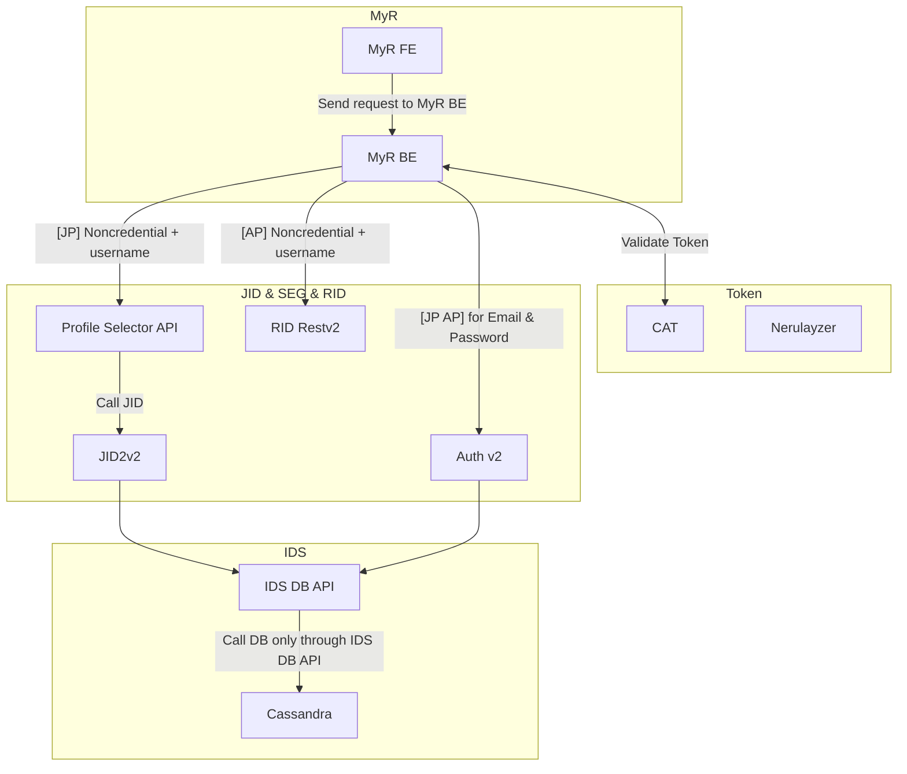

```mermaid

graph 
    subgraph MyR
        FE.MyR[MyR FE]
        BE.MyR[MyR BE]
    end

    subgraph Token
        CAT[CAT]
        Nerulayzer[Nerulayzer]
    end

    subgraph JID & SEG & RID
        BE.ProfileSelector[Profile Selector API]
        BE.JID2v2[JID2v2]
        BE.Authv2[Auth v2]
        BE.Restv2[RID Restv2]
    end

    subgraph IDS
        DB.API[IDS DB API]
        DB[Cassandra]
    end

    FE.MyR -- "Send request to MyR BE" --> BE.MyR
    BE.MyR -- "[JP] Noncredential + username" --> BE.ProfileSelector
    BE.MyR <-- "Validate Token" --> CAT
    BE.MyR -- "[AP] Noncredential + username" --> BE.Restv2
    BE.MyR -- "[JP AP] for Email & Password" --> BE.Authv2
    BE.ProfileSelector -- "Call JID" --> BE.JID2v2
    BE.JID2v2 -- " " --> DB.API
    BE.Authv2 -- " " --> DB.API
    DB.API -- "Call DB only through IDS DB API" --> DB
```