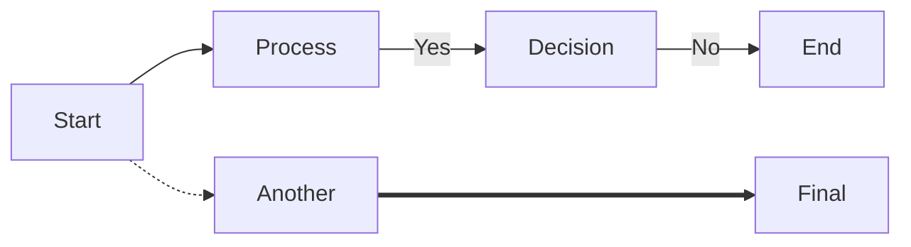
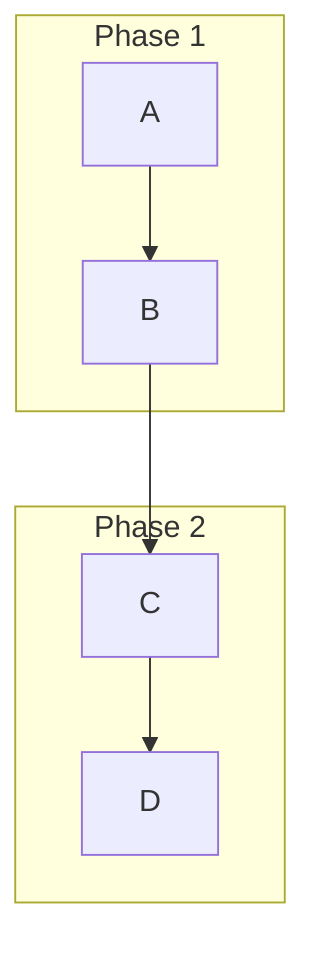
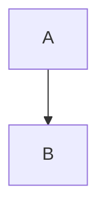

# Basic Mermaid Syntax
Mermaid is a Markdown-inspired syntax for generating diagrams and flowcharts from text. It's designed to be simple and easy to read.

Here's a breakdown of the most common and basic syntax elements:

1. Diagram Type Declaration:
Every Mermaid diagram starts by declaring its type.

- Flowchart: graph LR (Left to Right), graph TD (Top Down), graph RL (Right to Left), graph BT (Bottom Top)
- Sequence Diagram: sequenceDiagram
- Gantt Chart: gantt
- Class Diagram: classDiagram
- State Diagram: stateDiagram-v2
- Pie Chart: pie
- Git Graph: gitGraph

2. Nodes (Shapes):
Nodes are the boxes, circles, or other shapes that represent steps or entities.

Default Rectangle: id[Text]
A[This is a node]
Rounded Edges: id(Text)
B(This is a rounded node)
Circle: id((Text))
C((This is a circle))
Stadium-shaped: id([Text])
D([This is a stadium])
Subroutine (Cylinder): id(((Text)))
E(((This is a cylinder)))
Rhombus (Decision): id{Text}
F{Is this a decision?}
Hexagon: id{{Text}}
G{{This is a hexagon}}
Asymmetric (Flag): id>Text]
H>This is a flag]


3. Links/Edges (Arrows):
Links connect nodes and show relationships.

- Basic Arrow: A --> B
- Arrow with Text: A -- Text --> B
- Open Arrow (no head): A --- B
- Dotted Line: A -.-> B
- Dotted Line with Text: A -. Text .-> B
- Thick Arrow: A ===> B
- Thick Arrow with Text: A == Text ===> B



4. Subgraphs:
Group related nodes together.

subgraph Name
Node1 --> Node2
end



5. Comments:
Starts with %%.

%% This is a comment and will be ignored


# The most common ways to use Mermaid are:

1. Markdown Files (.md or .markdown): This is how we've been using it. You embed the Mermaid code blocks directly within your Markdown document using the fenced code block syntax:

```

```

This is the most popular and supported way, especially in tools like VS Code, GitHub, GitLab, Jira, Confluence, and many other Markdown renderers.


2. HTML Files: You can include the Mermaid JavaScript library in an HTML page and embed the Mermaid code within <div> tags. This allows dynamic rendering in web browsers.
```
<!DOCTYPE html>
<html lang="en">
<head>
    <meta charset="UTF-8">
    <title>Mermaid Diagram</title>
    <script type="module">
        import mermaid from 'https://cdn.jsdelivr.net/npm/mermaid@10/dist/mermaid.esm.min.mjs';
        mermaid.initialize({ startOnLoad: true });
    </script>
</head>
<body>
    <div class="mermaid">
        graph TD
            A[Start] --> B(End)
    </div>
</body>
</html>

```
